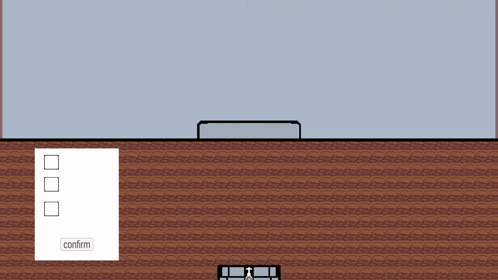

# CheckBoxesAndBoxSelect
## Description
This is a showcase for an object selection and tagging system for my upcoming indie game "Chrono-Vice". This system works by using a box selection method to select GameObjects and then using a checkbox method to assign "real" or "fake" tags to those GameObjects. These tags take the form of child GameObject. This system will be used as a fake object identification gameplay mechanic for "Chrono-Vice". This mini-project is a baseline for the eventual full fake confirmation method, so it can be easily updated and utilized for other use cases.
## Credit
The Box Selection Method is mostly taken from this Youtube Channel: Alexander Zotov [link]( https://www.youtube.com/watch?v=vZ0T7mExfhY&list=PL6yItMct2ybov1Z3InuFPpFmFY61NtOvH&index=66) 
His code [code](Assets/scripts/boxSelection.cs), [code](Assets/scripts/ObjectSelected.cs)
## Demonstration 

## Demo Description
The Demo showcases the checbox system and the ability to evaluate a GameObject and assign it a child fake or Real GameObject. 
Note: The nonchangeable child GameObjects are by design, if a GameObject already has a fake or real child, they are not to be changed. 
CheckBoxes [code](Assets/scripts/checkBoxes.cs), CheckBoxConfirmation(evaluation) [code](Assets/scripts/checkBoxConfirmation.cs) 

